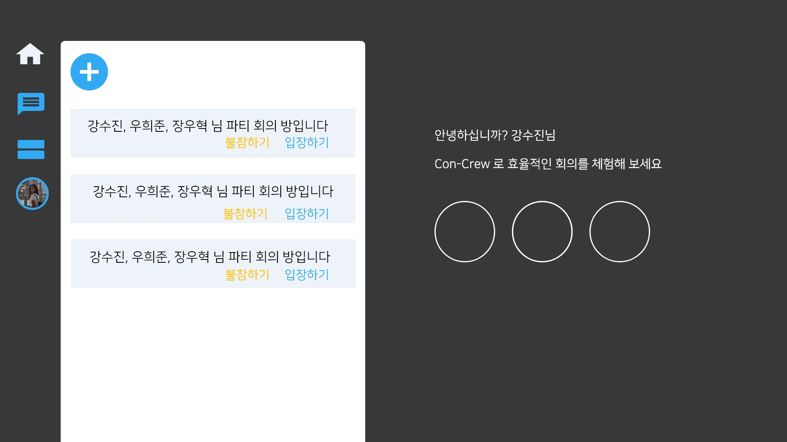
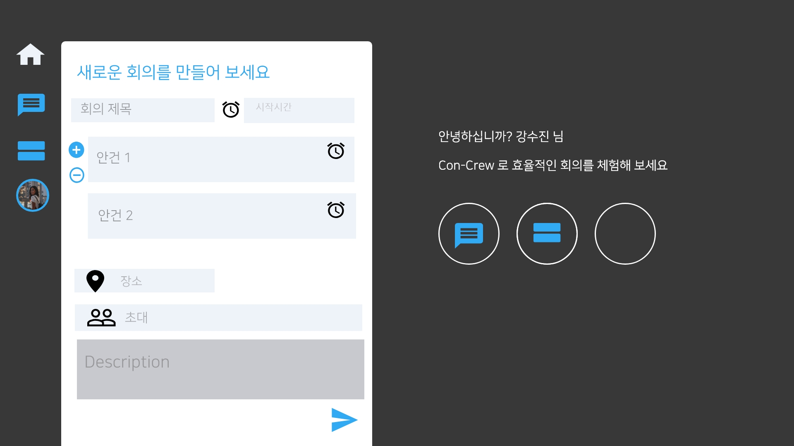
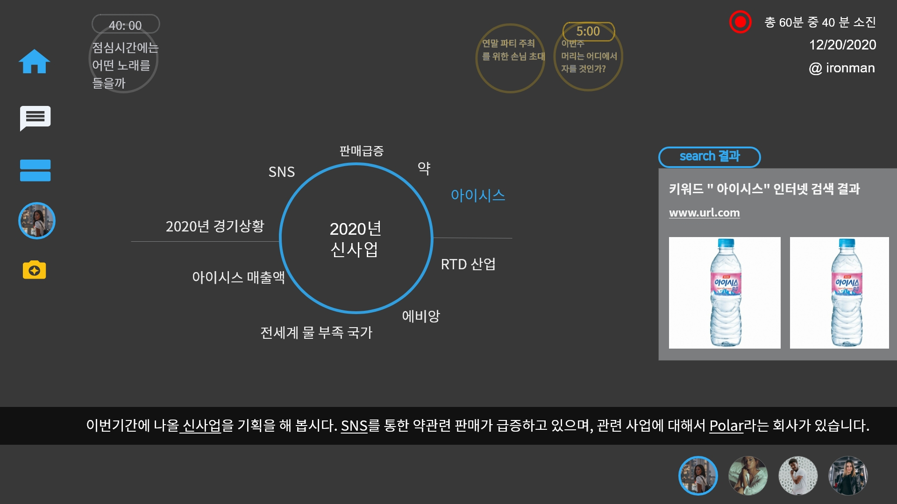
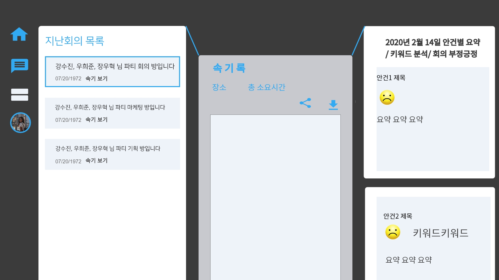
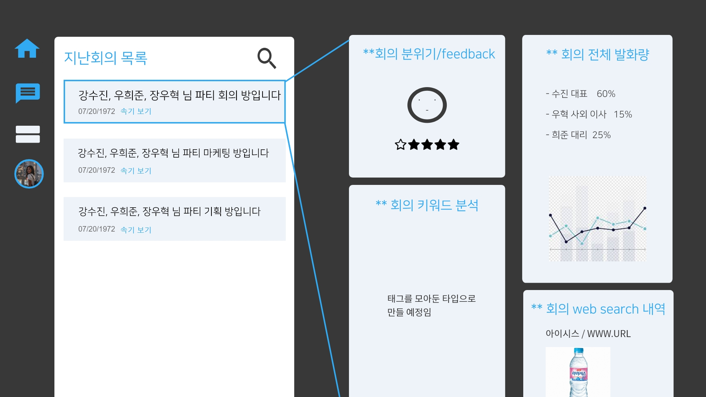

# Medi2020

## Description
AI를 사용하여 낭비되는 회의 시간을 줄이고 회의록을 자동 작성하여 효율적인 회의 운영을 도와 커뮤니케이션을 원활히 할 수 있게 해주는 C-crew Concrew 입니다! 

## Usage

- 회의 참여자 별 발화 양 분석회의 안건 별 긍정, 부정 단어 판별 결론 도출에 도움
- 회의 시간 제한 설정
- 속기 작성
- 회의 자동 요약
- 실시간 자막 
- Web search 
- 키워드 분석

### Client-side
- Client url : https://www.notion.so/front-526da7702a1f464fad58faafff1c1fc4
### Server-side
- Backend interface https://www.notion.so/Backend-Interface-960f826f348d47eeaef0ce886de36ece
- Backend API https://www.notion.so/Backend-API-2cbcc055c0f444668d80efaaa894fb87

# Design 
홈화면

회의명과 안건을 입력하고 사용자를 초대해요!

회의 중에는 실시간으로 진행중인 안건과 속기, 키워드 등이 뜨며 관련 내용을 검색할 수 있어요! 

회의가 끝나고 지난 회의에 대한 속기록과 안건별 긍정도 분석과 키워드, 요약내용을 볼 수 있어요!

한눈에 회의의 분위기와 회의에서 나왔던 키워드와 화자별 발화량, 검색 내역을 확인하고 더 나은 다음 회의를 준비할 수 있어요!

- Design Note https://www.notion.so/Design-acb7813904d84d7fa99afa4e88e09e7e

# Demo 
